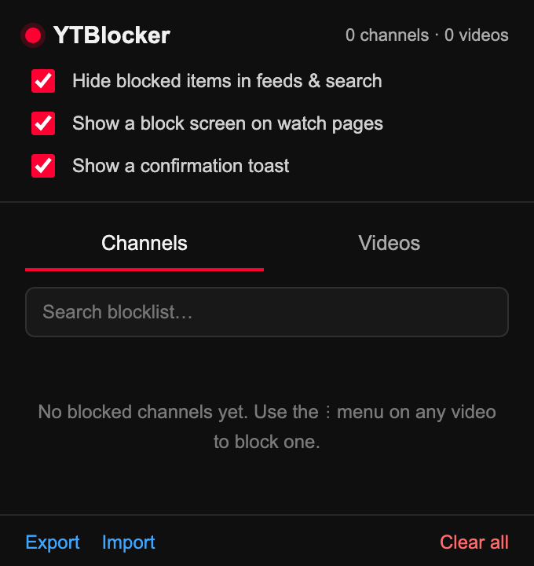

# YTBlocker

A Chrome extension that adds **Block Channel** and **Block Video** to YouTube's
three-dot menu, and hides blocked videos and channels everywhere on the site.

## Install

1. Open `chrome://extensions` and turn on Developer mode.
2. Click Load unpacked and select this folder.
3. Open YouTube and click the three-dot button on any video.

## Usage

- Block a channel or video from the three-dot menu on any video card. The menu
  item changes to Unblock once it is blocked.
- Unblock from that menu, from the block screen, or from the extension popup.
- The popup also has search, JSON import/export, and toggles for hiding blocked
  items, the watch-page block screen, and the confirmation toast.

## Notes

- Works on `www.youtube.com`.
- Blocked items are hidden as the page renders, so they can flash briefly first.
- YouTube changes its markup often. If the menu items stop showing, update the
  selectors at the top of `src/extract.js` and `src/menu.js`.
- All data stays in your browser. The extension makes no network requests.
