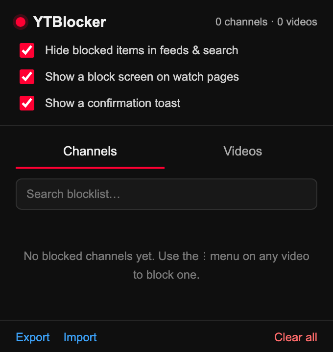

# YTBlocker

A Chrome extension that allows the blocking of channels and individual videos on YouTube.

## Install

1. Open `chrome://extensions` and turn on Developer mode.
2. Click **Load unpacked** and select this folder.
3. Empty cache & hard reload browser & refresh YouTube.

## Usage

- Block a channel or video from the three-dot menu on any video card. The menu
  item changes to Unblock once it is blocked.
- On a channel page (e.g. `youtube.com/@WW2TV`), a floating **Block channel**
  button appears in the bottom-right corner. It switches to **Unblock channel**
  once blocked. You can hide it with the "Show a block button on channel pages"
  setting.
- In the extension popup you can paste a channel or video URL to add it to the
  blocklist, or click **Block current tab** to block whatever channel/video the
  active YouTube tab is showing.
- Unblock from that menu, from the block screen, from the channel-page button,
  or from the extension popup.
- The popup also has search, JSON import/export, and toggles for hiding blocked
  items, the watch-page block screen, the channel-page block button, and the
  confirmation toast.

## Notes

- Blocked items are hidden as the page renders, so they can flash briefly first.
- YouTube changes its markup often. If the menu items stop showing, update the
  selectors at the top of `src/extract.js` and `src/menu.js`.
- All data stays in your browser. The extension makes no network requests.

## Project layout

- `src/state.js` – blocklist state and `chrome.storage` persistence.
- `src/url.js` – parses pasted YouTube channel/video URLs in the popup.
- `src/extract.js` – pulls channel/video details out of YouTube's DOM.
- `src/menu.js` – injects the Block/Unblock item into the three-dot menus.
- `src/channelbutton.js` – floating Block channel button on channel pages.
- `src/filter.js` – hides blocked cards and shows the watch-page block screen.
- `src/content.js` – boots the content script and handles popup messages.
- `popup/` – the toolbar popup (search, URL add, current-tab block, settings).

## License

MIT. See [LICENSE](LICENSE).
